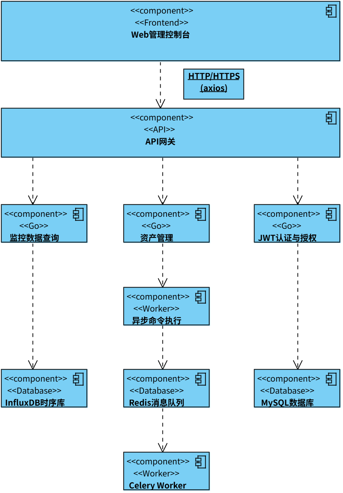

# 🇬🇧 English | [🇨🇳 中文](./README.zh.md)

# SmartOps — Smart Operations Monitoring System

> A lightweight monitoring and task execution platform for IT operations. Centrally manage server assets, monitor system metrics in real-time, and execute batch shell commands.


## 📌 Project Positioning

This system addresses two core pain points in operations:

- **Centralized Management**: Unified management of server asset information (IP, hostname, OS, status, etc.)
- **Batch Operations**: Execute shell commands on multiple servers simultaneously and track execution results

The system adopts a frontend-backend separation architecture. The backend provides RESTful APIs, and the frontend offers a visual operation interface. Monitoring data is stored in a time-series database, supporting historical trend queries and chart visualization.


## 🛠 Tech Stack

| Layer | Technology |
| :--- | :--- |
| **Backend Framework** | FastAPI (Python 3.9+) |
| **Frontend Framework** | Vue 3 + Vite |
| **UI Component Library** | Element Plus |
| **Relational Database** | MySQL (SQLAlchemy ORM) |
| **Time-Series Database** | InfluxDB 2.x |
| **Task Queue** | Celery + Redis |
| **Visualization** | ECharts |
| **Authentication** | JWT (python-jose) |
| **SSH Client** | Paramiko |


## 📁 System Architecture

{width=80%}


## 🚀 Core Features

### Backend Modules

| Module | Function |
| :--- | :--- |
| **User Authentication** | Registration / Login / JWT Token / Password Reset |
| **Asset Management** | CRUD operations for server assets (IP, hostname, OS, status) |
| **Command Execution** | Execute shell commands on specified assets, support batch execution |
| **Task Queue** | Asynchronous execution of time-consuming commands via Celery to prevent blocking |
| **Monitoring Data** | Query time-series data (CPU/Memory/Network) from InfluxDB |
| **Data Simulation** | Automatically generate mock monitoring data for demonstration purposes |

### Frontend Pages

| Page | Function |
| :--- | :--- |
| **Login / Register** | User authentication and account registration |
| **Dashboard** | Real-time trend charts for CPU/Memory/Network, with host switching and time range filtering |
| **Asset Management** | Asset list display, search, status modification, deletion |
| **Command Dispatch** | Select target assets → Enter shell command → Batch execute → View results |
| **Task List** | View historical command execution records and status (Pending/Running/Success/Failed) |
| **User Management** | Admin view user list, modify roles, delete users |
| **Password Change** | Current user password modification |


## 🔧 Quick Start

### Requirements
- Python 3.9+
- Node.js 16+
- MySQL 5.7+
- InfluxDB 2.x
- Redis (optional, required for Celery)

### 1. Clone Repository

```bash
git clone https://github.com/asrcds/smartops.git
cd smartops
```
### 2. Backend Setup
```bash
# Enter backend directory
cd backend

# Create virtual environment
python -m venv venv
source venv/bin/activate  # Windows: venv\Scripts\activate

# Install dependencies
pip install -r requirements.txt

# Configure environment variables (create .env file)
# See configuration section below

# Initialize database tables
python -c "from utils.db import engine; from models import *; Base.metadata.create_all(engine)"

# Start backend service
uvicorn main:app --reload --host 0.0.0.0 --port 8000
```
### 3. Frontend Setup
```bash
# Enter frontend directory
cd frontend

# Install dependencies
npm install

# Start development server
npm run dev
```
Visit http://localhost:5173 to access the frontend.
### 4. Start Mock Data Writer
```bash
# Run in backend directory
python mock_data_writer.py
```
### 5. Start Celery Task Queue
```bash
# Run in backend directory
celery -A celery_worker worker --loglevel=info
```
## ⚙️ Environment Variables
```bash
# MySQL
DB_URL=localhost
DB_USER=root
DB_PASSWORD=your_password
DB_NAME=smartops

# InfluxDB
INFLUX_URL=http://localhost:8086
INFLUX_TOKEN=your_influxdb_token
INFLUX_ORG=your_org
INFLUX_BUCKET=your_bucket

# JWT
SECRET_KEY=your_jwt_secret_key

# Mock data hostname
HOST=mock_server01
```
## 📄 Future Research Directions
This system is an undergraduate capstone project and will evolve further in the master's thesis:

- **Log Data Integration:** Collect system logs and trace data to complement pure metric monitoring

- **Graph-Based Analysis:** Abstract trace relationships into topology graphs to assist fault localization

- **Multi-Agent Diagnosis:** Build a collaboration system of Navigator/Diagnostician/Validator agents based on LLMs for automated root cause analysis

- **Intelligent Ops Loop:** Upgrade from "data visualization" to "automatic problem detection → root cause localization → solution recommendation"
## 📝 License
For educational and research purposes only.
